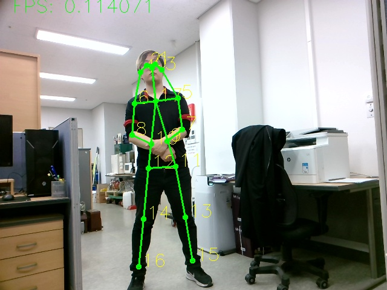

# OctoPD(Octo=8 Pose Detection)
It's not relate with Meaning Eight, my Team No. is 8, so I select name about the Octo.

# 1. 목적
 ## *미래의 인간을 대신해서 우리를 도와줄 서포트 로봇 휴먼 포징으로 앞의 사람같은게 있다는 것을 모바일 로봇에게 인식시켜보자!*<br><br>


# 1.1 일반 노트북으로 무조건 도전!<br>
## Computer Spec
CPU : Intel CORE i7 <br>
GPU : NVIDIA GTX 2070 <br>
RAM : 16 GB <br>
OS : Linux 22.04 LTS <br>

## Using Library 
Python = 3.10.6<br>
PyTorch = 2.0.0<br>
CUDA = 11.7<br>
cuDNN = 8.2.1<br>

## Pre-Trained Models
- Tiny-YOLO oneclass - [.pth](https://drive.google.com/file/d/1obEbWBSm9bXeg10FriJ7R2cGLRsg-AfP/view?usp=sharing),
[.cfg](https://drive.google.com/file/d/19sPzBZjAjuJQ3emRteHybm2SG25w9Wn5/view?usp=sharing)
- SPPE FastPose (AlphaPose) - [resnet101](https://drive.google.com/file/d/1N2MgE1Esq6CKYA6FyZVKpPwHRyOCrzA0/view?usp=sharing),
[resnet50](https://drive.google.com/file/d/1IPfCDRwCmQDnQy94nT1V-_NVtTEi4VmU/view?usp=sharing)
- ST-GCN action recognition - [tsstg](https://drive.google.com/file/d/1mQQ4JHe58ylKbBqTjuKzpwN2nwKOWJ9u/view?usp=sharing)

<b align="right">
 
<b align="left">


## 1.2 Micro Controller Unit(MCU)로 도전

## Computer Spec
Model : Jetson NANO 4GB <br>
CPU : Quad-core ARM A57 @ 1.43 GHz
GPU : 128-core Maxwell <br>
RAM : 16 GB <br>
OS : Linux 18.02 LTS <br>
※JetPack = 4.6.3

## Using Library 
Python = 3.10.6<br>
PyTorch = 1.8.0<br>
CUDA = 10.2<br>
cuDNN = 7.6.5<br>
TensorRT = 8.2.1<br>

## Pre-Trained Models

 Model | Jetson Nano | Jetson Xavier | Weights |
|-------|-------------|---------------|---------|
| resnet18_baseline_att_224x224_A | 22 | 251 | [download (81MB)](https://drive.google.com/open?id=1XYDdCUdiF2xxx4rznmLb62SdOUZuoNbd) |
| densenet121_baseline_att_256x256_B | 12 | 101 | [download (84MB)](https://drive.google.com/open?id=13FkJkx7evQ1WwP54UmdiDXWyFMY1OxDU) |

<a align="center">
 <br><br><br><br>


<a align="center">


### 1.3 모델융합

#### - 코드 형식 간결화 및 python parser -h 기능  추가 완료
#### - YOLO 모델 TINY v3 를 적용
#### - Pretrained된 MMSKeleton 적용으로 간단한 Sit down, Stand Up, Walking, Fall Down 등을 적용

-------------------------------------------
- 여러 요구상황에 대한 라벨링을 실시 <br>
병원 - 요양 중이 환자들의 상태 체크
경찰 - 대테러 및 사건발생 지역에서 색적 및 경계 등 
가정 - 맞벌이 부부를 위한 아기 돌보미 등

## 2. 다이어그램
## 3. 어려웠던 부분

### 3.1 기존 사용했던 칩과의 차이

#### ARM과 X86의 차이

#### 영상 엔코딩 방식의 차이
   L42T
   OpenCV를 사용하되 사용하는 것은 C 기반인 <br>
   ## <A align="center" href="https://gstreamer.freedesktop.org/"> GStremer </A>
  <P>

<a align="center">


## 대파이선 시대에 이게 뭔 언어다냥...
```
gst-launch-1.0 uridecodebin uri="https://www.freedesktop.org/software/gstreamer-sdk/data/media/sintel_trailer-480p.webm" ! audioconvert ! autoaudiosink
```

### 3.2 최적화 Optimazing
 Jetson NANO에서 한 번 시동걸려니깐 3~5분은 잡아먹어! <br>
 C++ 해야함... 최악의 경우에는 FPGA를 사용해야한다.
### 3.3 수많은 삽질들...

#### - 2년만에 LiDAR 카메라 다시 만져보고 STM보드도..
#### - 사람과 로봇이 서로 상호작용을 위해서는 무엇인 가장 중요할까?
#### - 컨테이너 기반 Docker로 도전
#### - TensorRT는 또 뭐야....
#### - 리눅스 환경만 20번이상 재구축함
#### - 밤샘 밤샘 밤샘.... 오늘도 밤샘함
#### - 그래도 오랜만에 의욕이 불타오르는걸 느낌
#### - 허나 엔지니어로써는 실격 휴식도 제대로 안 취하고 결과도....
## - 잡캐라서 행복해요. 그러나 역시 메인은 임베디드 엔지니어!


### 4. Reference

Human-Falling-Detect-Tracks
https://github.com/GajuuzZ/Human-Falling-Detect-Tracks<br>
NVIDIA-AI trt-pose
https://github.com/Robotics-Ro/trt_pose_plus/tree/master<br>
Gstreamer 기초
https://medium.com/may-i-lab/gstreamer-gstreamer-%EA%B8%B0%EC%B4%88-da5015f531fc
